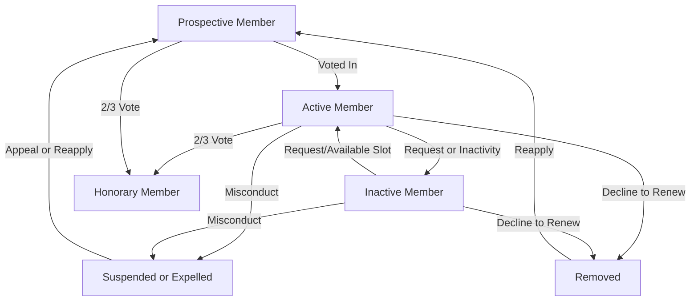

🛑 Suspension, Expulsion, and Non-Renewal

Under Article II, §6, clubs have explicit authority to:

- Discipline
- Suspend
- Expel
- Decline to renew a member

This authority is broad but bounded by some conditions.

🔹 Grounds for Action

A club may take action against a member who:

1. Fails to pay dues, or other minimum standards (such as attendance, if established by the club),
2. Fails to support the club's purposes (e.g. promoting leadership and communication development),
3. Does not constructively contribute to the club's program and activities,
4. Acts against the ethical or behavioral standards set by the club or by Toastmasters International (including those in Policy and Protocol documents),
5. Commits any other "just cause" determined by the club.

⚠️ Important: If the TI International President formally requests that a club expel a member for violating TI standards—and the club refuses—the club itself may be expelled from Toastmasters unless it can justify its decision to the Board.

🔹 Club Responsibilities in Taking Action

- The Constitution doesn't mandate a specific disciplinary process, but the club may establish its own routine procedures.
- This includes automatic removal for nonpayment or prolonged absence.
- Any such procedures must comply with TI's Policy and Protocol if one exists.

🔁 Membership State Model

Let's now map all possible member states and transitions, based on the Constitution.

🧭 Membership States

🗺️ Explanation of Transitions

|                                         |                                         |
| --------------------------------------- | --------------------------------------- |
| From                                    | To                                      |
| Prospective → Active                    | Invitation + majority vote + payment    |
| Active → Inactive                       | Member request or long absence          |
| Inactive → Active                       | Member request + available slot         |
| Active or Prospective → Honorary        | 2/3 vote of active members              |
| Active/Inactive → Suspended/Expelled    | Misconduct, nonpayment, or "just cause" |
| Active/Inactive → Removed (Non-renewed) | Club decision not to renew              |
| Suspended → Prospective                 | Must reapply and be voted back in       |

⚖️ Distinction Between Suspension and Expulsion

The Constitution does not define these terms precisely, so clubs may interpret them as:

|   |   |   |
|---|---|---|
|Status|Effect|Reinstatement|
|Suspended|Temporarily removed from rights/privileges; possibly still on rolls|May be reinstated without reapplying|
|Expelled|Removed from membership entirely|Must reapply and be voted in again|

✅ Strategic Implications for Clubs

- Use inactive status generously to avoid alienating infrequent members.
- Use suspension as a temporary step when resolving issues—especially if facts are in dispute.
- Use expulsion only with due care, documentation, and procedural fairness.
- Keep a membership standards policy on file (informal or formal), aligned with TI guidance, to justify any removal if challenged.

