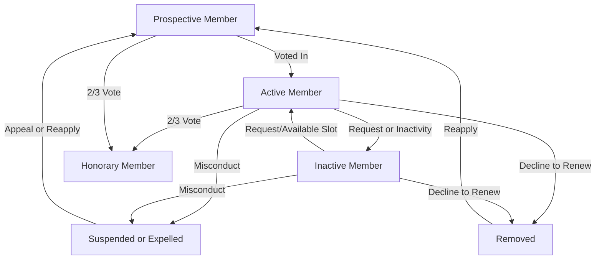

```mermaid
graph TD
  A[Prospective Member] -->|Voted In| B[Active Member]
  B -->|Request or Inactivity| C[Inactive Member]
  C -->|Request/Available Slot| B
  B -->|2/3 Vote| D[Honorary Member]
  A -->|2/3 Vote| D

  B -->|Misconduct| E[Suspended or Expelled]
  C -->|Misconduct| E
  B -->|Decline to Renew| F[Removed]
  C -->|Decline to Renew| F
  E -->|Appeal or Reapply| A
  F -->|Reapply| A
```
